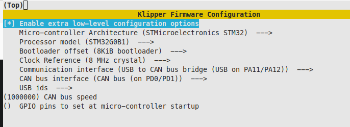
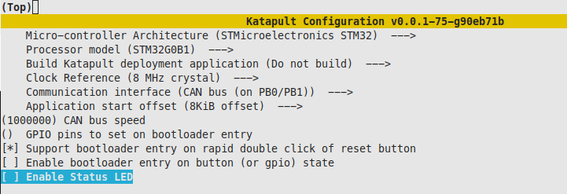
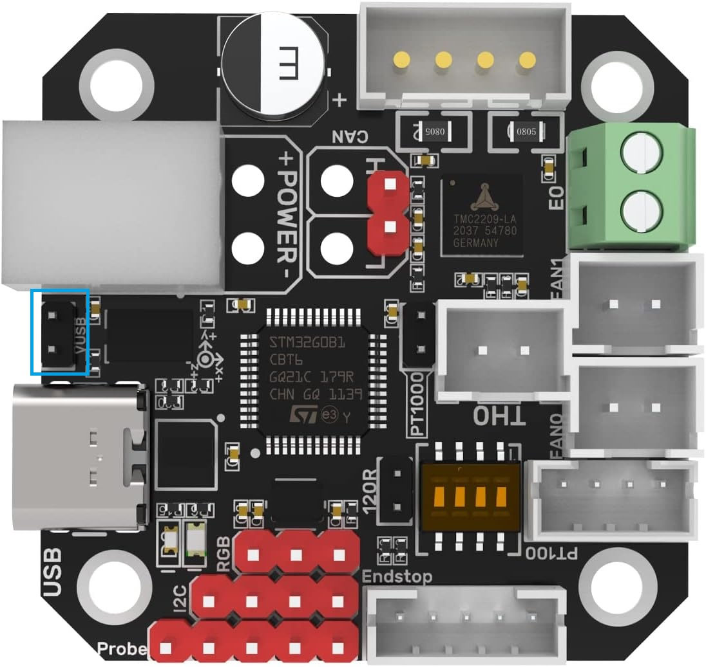
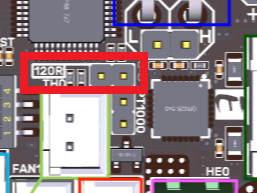
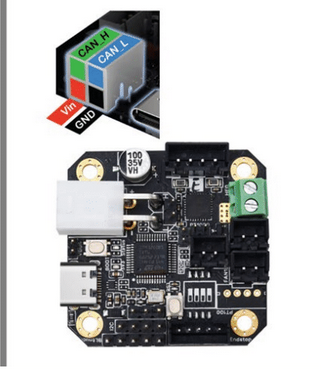
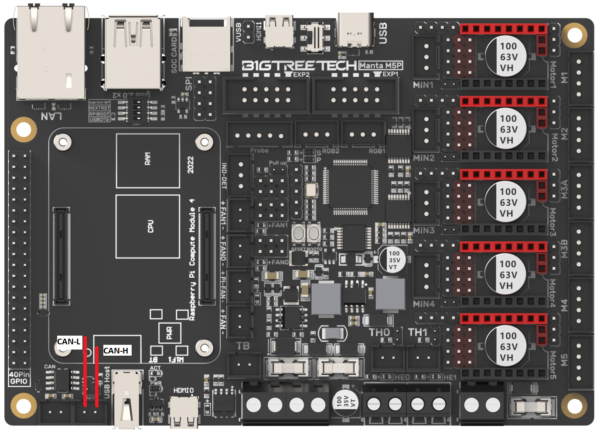
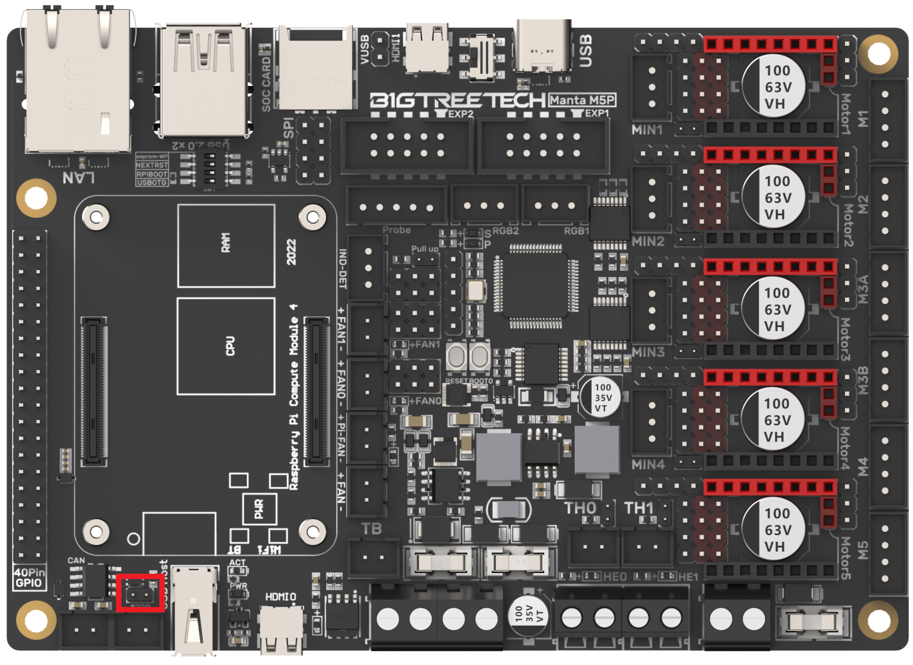

These instructions help you setup your K1 with EBB42 v1.1, v.1.2 using M5P - No need U2C
Thanks to EricZimmerman [guides](https://github.com/EricZimmerman/VoronTools/tree/main) and Maz0r [work](https://github.com/maz0r/klipper_canbus)

## BOM
EBB42    
2x M3 Heatset Inserts (OD 4.2mm x L 3mm)  
4x M2 Heatset Inserts (OD 3.5mm x L 3mm)  
4x M2.5 x 3mm flat head screws  
2x M3 x 20mm screws  


## Network 
1. Use nano to create a new file with the command sudo nano /etc/network/interfaces.d/can0  
2. Add the following code  
```
allow-hotplug can0
iface can0 can static
 bitrate 1000000
 up ifconfig $IFACE txqueuelen 1024
 pre-up ip link set can0 type can bitrate 1000000
 pre-up ip link set can0 txqueuelen 1024
```
3. Save the file with CTRL-o, ENTER, CTRL-x and reboot the pi with sudo reboot  
4. Verify the network via ip -s link show can0 which should reflect that the CAN network is UP. If the network is not found, connect your U2C via USB and repeat the command to verify the can0 network is up.  


## M5P
1. Clone Katapult to your Pi  

```
cd ~  
git clone https://github.com/Arksine/katapult
```  
2. Run the following commands to bring up the menu to configure the firmware  
```
cd katapult
make menuconfig
```  
3. Starting from the top, make your firmware selections look exactly like the image below  
  
4. Exit using ESC or Q, then confirm with yes (Y)  
5. Build the firmware using the following commands:  
```
make clean
make
```
If no errors continue  
6. Run the following commands to bring up the menu to configure the firmware (Klipper)
```
cd ~/klipper
make menuconfig
```
7. Starting from the top, make your firmware selections look exactly like the image below
  
8. Exit using ESC or Q, then confirm with yes (Y)  
9. Build the firmware using the following commands:
```
make clean
make
```
If no errors continue  

## Flashing Klipper to M5P
1. With power on the M5P side of the board, press and hold down the boot button then click the reset button, allow a secund or two to pass then release the boot button  
2. Run ``lsusb``  
3. Look for STM in DFU Mode in the output text then proceed, if not try step 1 again  
4. Run the following to flash katapult to M5P  
```
sudo dfu-util -a 0 -D ~/katapult/out/canboot.bin --dfuse-address 0x08000000:force:mass-erase -d 0483:df11
```
If no errors proceed  (If you see any mention of an error after the File downloaded successfully message, it can be ignored)  


5. Run the following to flash klipper to M5P
```
sudo dfu-util -a 0 -D ~/klipper/out/klipper.bin --dfuse-address 0x08002000:leave -d 0483:df11
```
If no errors proceed and click the reset button  the M5P (If you see any mention of an error after the File downloaded successfully message, it can be ignored>  


## Building and Flashing for EBB42

1. Run the following commands to bring up the menu to configure the firmware  
```
cd ~/katapult
make menuconfig
``` 

2. Starting from the top, make your firmware selections look exactly like the image below  
  
3. Exit using ESC or Q, then confirm with yes (Y)  
4. Build the firmware using the following commands:  
```
make clean
make
```
If no errors continue  

5. Run the following commands to bring up the menu to configure the firmware  (Klipper)
```
cd ~/klipper
make menuconfig
``` 
6. Starting from the top, make your firmware selections look exactly like the image below  
  
4. Plug in a USB-C cable from the EBB42 to your Pi and set the USB jumper
  
5. Hold down the boot button and press the reset button, wait a second or two and then release the boot button  
6. Run ``lsusb``  
7. Look for STM in DFU Mode in the output text then proceed, if not try step 2 again  
8. Run the following to flash Katapult to EBB42
```
sudo dfu-util -a 0 -D ~/katapult/out/canboot.bin --dfuse-address 0x08000000:force:mass-erase -d 0483:df11
```
If no errors proceed and click the reset button  the M5P (If you see any mention of an error after the File downloaded >  message, it can be ignored.  

9. Disconnect USB-C cable and remove the jumper
10. Place a jumper on the 120R header on the EBB42  



## Wiring
1. Disconnect all power  
2. Crimp the required wires to the molex connector on the EBB42  
3. ***Triple check your VIN, GND, CAN_H, CAN_L match the connector side on the EBB and on the M5P side***  
  
  
4. Place a jumper on the 120R header on the M5P  
  
